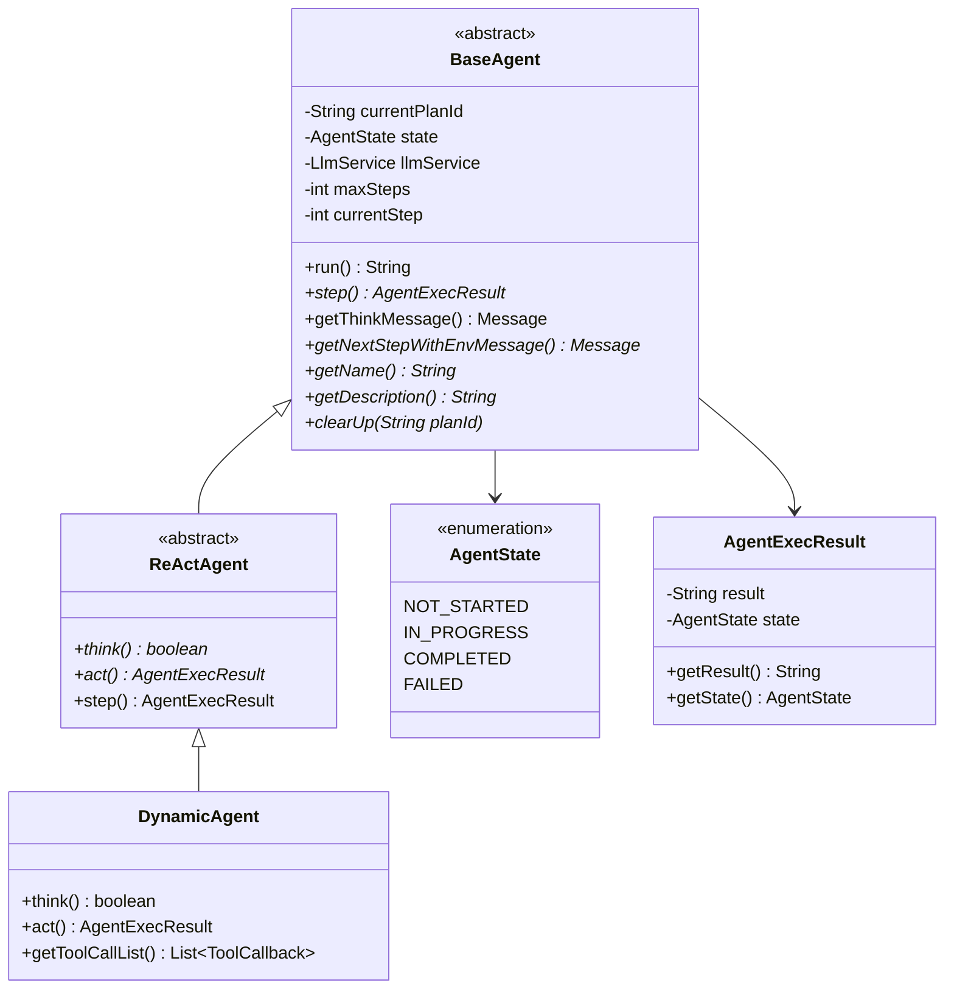
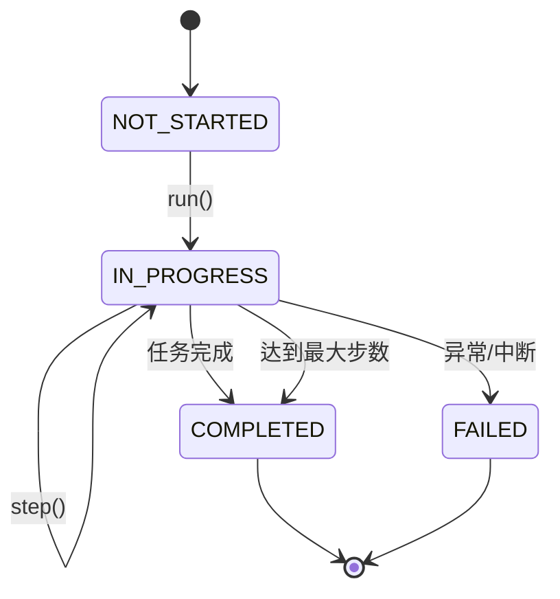
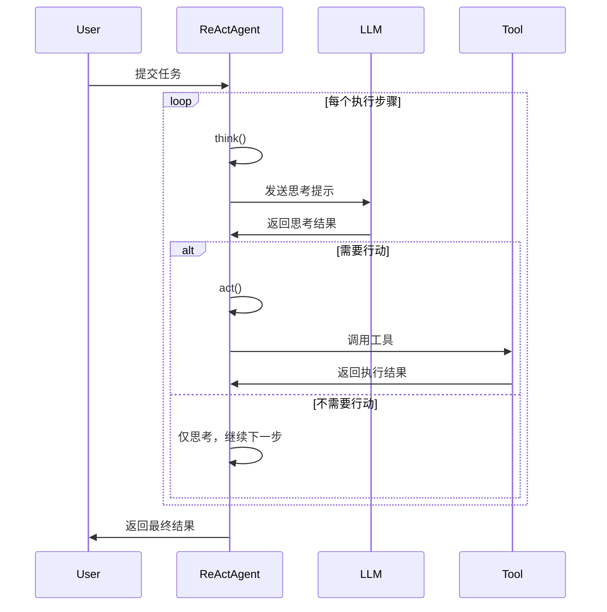

# 02 - 智能体系统详解

## 🤖 智能体概述

JManus 的智能体系统是一个基于 Spring AI Alibaba 的多智能体协作框架，支持不同类型的智能体实现，具有完整的状态管理、工具调用和生命周期管理功能。

## 🏗️ 智能体架构

### 类层次结构



## 📋 智能体状态管理

### AgentState 枚举

智能体具有四种状态，由 `AgentState` 枚举定义：

```java
public enum AgentState {
    NOT_STARTED,  // 未开始
    IN_PROGRESS,  // 执行中
    COMPLETED,    // 已完成
    FAILED        // 执行失败
}
```

### 状态转换流程



## 🔍 BaseAgent 核心实现

### 主要字段

```java
public abstract class BaseAgent {
    // 执行计划ID
    private String currentPlanId = null;
    private String rootPlanId = null;

    // 状态管理
    private AgentState state = AgentState.NOT_STARTED;

    // 核心服务
    protected LlmService llmService;
    protected final ManusProperties manusProperties;
    protected final PromptService promptService;

    // 执行控制
    private int maxSteps;
    private int currentStep = 0;

    // 数据上下文
    private final Map<String, Object> initSettingData;
    private Map<String, Object> envData = new HashMap<>();
}
```

### 核心方法分析

#### 1. run() - 主执行循环

**位置**: `BaseAgent.java:210`

```java
public String run() {
    currentStep = 0;
    if (state != AgentState.IN_PROGRESS) {
        throw new IllegalStateException("Cannot run agent from state: " + state);
    }

    while (currentStep < maxSteps && !state.equals(AgentState.COMPLETED)
           && !state.equals(AgentState.FAILED)) {
        currentStep++;
        log.info("Executing round {}/{}", currentStep, maxSteps);

        AgentExecResult stepResult = step();

        // 卡住检测
        if (isStuck()) {
            handleStuckState();
        } else {
            state = stepResult.getState();
        }
    }

    // 处理达到最大步数的情况
    if (currentStep >= maxSteps) {
        String finalSummary = generateFinalSummary();
        terminateWithSummary(finalSummary);
    }
}
```

**关键特性**:
- **步数限制**: 防止无限执行
- **卡住检测**: 自动检测智能体是否陷入循环
- **状态管理**: 完整的状态转换控制
- **资源清理**: 执行完成后自动清理内存

#### 2. step() - 单步执行

**位置**: `BaseAgent.java:283` (抽象方法)

子类必须实现的核心逻辑，定义每一步的具体执行内容。

#### 3. getThinkMessage() - 构建思考链

**位置**: `BaseAgent.java:146`

```java
protected Message getThinkMessage() {
    // 获取系统信息
    String osName = System.getProperty("os.name");
    String currentDateTime = java.time.LocalDate.now().toString();

    // 构建变量映射
    Map<String, Object> variables = new HashMap<>(getInitSettingData());
    variables.put("osName", osName);
    variables.put("currentDateTime", currentDateTime);

    // 创建系统消息
    return promptService.createSystemMessage(
        PromptEnum.AGENT_STEP_EXECUTION.getPromptName(),
        variables
    );
}
```

#### 4. 卡住检测机制

**位置**: `BaseAgent.java:305`

```java
protected boolean isStuck() {
    List<Message> memoryEntries = llmService.getAgentMemory(manusProperties.getMaxMemory())
                                           .get(getCurrentPlanId());
    int zeroToolCallCount = 0;

    for (Message msg : memoryEntries) {
        if (msg instanceof AssistantMessage) {
            AssistantMessage assistantMsg = (AssistantMessage) msg;
            if (assistantMsg.getToolCalls() == null ||
                assistantMsg.getToolCalls().isEmpty()) {
                zeroToolCallCount++;
            }
        }
    }

    // 连续3次无工具调用视为卡住
    return zeroToolCallCount >= 3;
}
```

## 🧠 ReActAgent 推理-行动模式

### 设计理念

ReAct (Reasoning + Acting) 是一种让 AI 模型在推理和行动之间交替执行的策略，让智能体能够：

1. **思考 (Reasoning)**: 分析当前情况，决定下一步行动
2. **行动 (Acting)**: 执行具体的工具调用或操作
3. **观察 (Observing)**: 查看行动结果，更新认知
4. **循环**: 重复上述过程直到任务完成

### 实现分析

**位置**: `ReActAgent.java:31`

```java
public abstract class ReActAgent extends BaseAgent {

    /**
     * 执行思考过程并确定是否需要采取行动
     */
    protected abstract boolean think();

    /**
     * 执行具体的行动
     */
    protected abstract AgentExecResult act();

    /**
     * 执行完整的思考-行动步骤
     */
    @Override
    public AgentExecResult step() {
        try {
            boolean shouldAct = think();
            if (!shouldAct) {
                return new AgentExecResult(
                    "Thinking complete - no action needed",
                    AgentState.IN_PROGRESS
                );
            }
            return act();
        } catch (TaskInterruptedException e) {
            return new AgentExecResult(
                "Agent execution interrupted: " + e.getMessage(),
                AgentState.FAILED
            );
        }
    }
}
```

### ReAct 循环流程



## 🛠️ DynamicAgent 动态智能体

### 设计特点

DynamicAgent 是 ReActAgent 的具体实现，具有以下特点：

1. **动态工具配置**: 运行时可以选择和配置不同的工具
2. **流式响应处理**: 支持实时的流式 AI 响应
3. **重试机制**: 内置智能重试策略
4. **用户交互支持**: 集成表单输入工具
5. **中断处理**: 完善的任务中断机制

### 核心实现

**位置**: `DynamicAgent.java:69`

#### 1. 构造函数参数

DynamicAgent 接受丰富的配置参数，包括 LLM 服务、工具管理器、流式响应处理器等。

#### 2. think() - 智能思考过程

**位置**: `DynamicAgent.java:151`

关键特性：
- **中断检查**: 在思考开始前检查是否被中断
- **环境数据收集**: 收集所有可用工具的状态信息
- **重试策略**: 最多重试3次，使用指数退避算法

#### 3. 重试机制

**位置**: `DynamicAgent.java:176`

```java
private boolean executeWithRetry(int maxRetries) throws Exception {
    // 指数退避: delay = min(1000 * 2^(attempt-1), 30000ms)
    // 可重试异常: 网络错误、超时、DNS解析失败等
}
```

#### 4. act() - 执行工具调用

**位置**: `DynamicAgent.java:330`

- 检查中断状态
- 执行工具调用
- 处理特殊工具（FormInputTool、TerminableTool）
- 记录执行结果

## 🔍 实践验证与深度分析

### 启动日志验证

通过 `mvn spring-boot:run` 启动日志验证了我们的理论分析：

```log
2025-11-16 18:39:39.622  INFO 69970 --- c.a.c.ai.manus.planning.PlanningFactory  : Registering tool: browser_use
2025-11-16 18:39:39.624  INFO 69970 --- c.a.c.ai.manus.planning.PlanningFactory  : Registering tool: database_read_use
2025-11-16 18:39:39.625  INFO 69970 --- c.a.c.ai.manus.planning.PlanningFactory  : Registering tool: database_write_use
2025-11-16 18:39:39.625  INFO 69970 --- c.a.c.ai.manus.planning.PlanningFactory  : Registering tool: database_metadata_use
2025-11-16 18:39:39.626  INFO 69970 --- c.a.c.ai.manus.planning.PlanningFactory  : Registering tool: uuid_generate
2025-11-16 18:39:39.630  INFO 69970 --- c.a.c.ai.manus.planning.PlanningFactory  : Registering tool: terminate
2025-11-16 18:39:39.633  INFO 69970 --- c.a.c.ai.manus.planning.PlanningFactory  : Registering tool: bash
2025-11-16 18:39:39.634  INFO 69970 --- c.a.c.ai.manus.planning.PlanningFactory  : Registering tool: local_file_operator
2025-11-16 18:39:39.635  INFO 69970 --- c.a.c.ai.manus.planning.PlanningFactory  : Registering tool: global_file_operator
2025-11-16 18:39:39.635  INFO 69970 --- c.a.c.ai.manus.planning.PlanningFactory  : Registering tool: directory_operator
2025-11-16 18:39:39.636  INFO 69970 --- c.a.c.ai.manus.planning.PlanningFactory  : Registering tool: form_input
2025-11-16 18:39:39.636  INFO 69970 --- c.a.c.ai.manus.planning.PlanningFactory  : Registering tool: parallel_execution_tool
2025-11-16 18:39:39.637  INFO 69970 --- c.a.c.ai.manus.planning.PlanningFactory  : Registering tool: cron_tool
2025-11-16 18:39:39.638  INFO 69970 --- c.a.c.ai.manus.planning.PlanningFactory  : Registering tool: markdown_converter
2025-11-16 18:39:39.655  INFO 69970 --- c.a.c.ai.manus.planning.PlanningFactory  : Registered 1 subplan tools
```

**重要发现**：
- ✅ 15个核心工具成功注册到 `PlanningFactory`
- ✅ 动态工具加载机制（每次HTTP请求都重新注册）
- ✅ 工具名称与代码分析完全一致

### 双层工具系统架构验证

通过实际API测试验证了双层工具系统设计：

```bash
# 查看内部工具（PlanningFactory）
curl -X GET "http://localhost:18080/api/tools"
# 返回15个已注册的内部工具

# 查看外部工具（CoordinatorTool）
curl -X GET "http://localhost:18080/api/coordinator-tools"
# 返回启用HTTP服务的工具列表
```

**架构验证**：
- ✅ **内层**：PlanningFactory 管理15个核心工具
- ✅ **外层**：CoordinatorTool 提供HTTP API访问
- ✅ **访问控制**：只有 `enableHttpService: true` 的工具才能通过API访问

### 状态管理详细分析

#### AgentState 枚举的完整状态

基于 `AgentState.java:18-21` 的最新发现：

```java
public enum AgentState {
    NOT_STARTED("not_started"),    // 未开始
    IN_PROGRESS("in_progress"),    // 执行中
    COMPLETED("completed"),        // 已完成
    BLOCKED("blocked"),            // 被阻塞
    FAILED("failed"),              // 失败
    INTERRUPTED("interrupted");    // 被中断
}
```

**新增状态**：
- `BLOCKED`：等待外部输入或资源
- `INTERRUPTED`：用户主动中断

### Think-Act循环的详细实现

#### Think阶段深入分析（DynamicAgent.java:172-350）

**1. 中断检查机制**：
```java
if (agentInterruptionHelper != null &&
    !agentInterruptionHelper.checkInterruptionAndContinue(getRootPlanId())) {
    throw new TaskInterruptedException();
}
```

**2. 环境数据收集**：
```java
collectAndSetEnvDataForTools();
```

**3. 重试机制**：
```java
boolean result = executeWithRetry(3);  // 最多3次重试
```

**4. LLM调用过程**：
- **系统消息**：`getThinkMessage()` - 包含系统信息和智能体信息
- **历史记忆**：`ChatMemory` - 管理对话历史
- **当前环境**：`currentStepEnvMessage()` - 任务上下文信息
- **流式处理**：`StreamingResponseHandler` - 实时响应处理

**5. 工具选择记录**：
```java
List<ActToolParam> actToolInfoList = new ArrayList<>();
for (ToolCall toolCall : toolCalls) {
    ActToolParam actToolInfo = new ActToolParam(
        toolCall.name(),
        toolCall.arguments(),
        toolcallId
    );
    actToolInfoList.add(actToolInfo);
}
// 记录Think-Act过程
planExecutionRecorder.recordThinkingAndAction(step, paramsN);
```

#### Act阶段深入分析（DynamicAgent.java:378-417）

**1. 并行工具执行**：
```java
Map<String, ToolExecutionResult> toolResults =
    parallelExecutionService.executeParallel(toolCalls);
```

**2. 特殊工具处理**：
- `FormInputTool`：等待用户输入
- `TerminateTool`：结束执行
- `ErrorReportTool`：错误报告
- `SystemErrorReportTool`：系统级错误处理

**3. 结果收集和状态更新**：
- 收集所有工具执行结果
- 更新智能体状态
- 记录执行日志

## 🏗️ 关键设计模式分析

### 1. 模板方法模式（Template Method）

**位置**：`BaseAgent` 抽象类
**实现**：定义执行框架，子类实现具体逻辑

```java
// BaseAgent 定义执行流程模板
public AgentExecResult execute(int maxSteps) {
    // 模板方法：定义执行骨架
    for (int currentStep = 1; currentStep <= maxSteps; currentStep++) {
        AgentExecResult stepResult = step();  // 子类实现具体逻辑
        // 通用状态检查和处理
        handleStepResult(stepResult);
    }
}
```

### 2. 策略模式（Strategy Pattern）

**位置**：不同类型的智能体
**实现**：`BaseAgent`、`ReActAgent`、`DynamicAgent` 不同执行策略

### 3. 工厂模式（Factory Pattern）

**位置**：`PlanningFactory`
**实现**：统一管理工具注册和获取

### 4. 观察者模式（Observer Pattern）

**位置**：事件系统
**实现**：`JmanusListener`、事件发布器

## 🔧 性能优化特性

### 1. 并行工具执行
- **实现**：`ParallelToolExecutionService`
- **优势**：提高多工具调用效率

### 2. 流式响应处理
- **实现**：`StreamingResponseHandler`
- **优势**：实时响应，改善用户体验

### 3. 连接池优化
- **实现**：HikariCP 数据库连接池
- **优势**：高效的数据库访问

### 4. 缓存机制
- **实现**：MCP 缓存、配置缓存
- **优势**：减少重复计算

## 📊 学习成果总结

### 技术理解深化

1. **智能体架构**：深入理解了三层继承架构的设计思想
2. **状态管理**：掌握了6种状态的完整生命周期管理
3. **ReAct 模式**：理解了推理-行动循环的具体实现
4. **工具系统**：掌握了双层工具系统的架构设计
5. **API 设计**：理解了 `ManusController` 的关键端点设计

### 实践验证成果

1. **启动验证**：通过启动日志验证了工具注册机制
2. **API验证**：通过实际调用验证了双层工具系统
3. **代码跟踪**：通过源码分析验证了理论理解
4. **日志分析**：通过运行时日志验证了执行流程

### 企业级特性理解

1. **错误恢复**：多层次错误处理和重试机制
2. **性能优化**：并行执行、流式响应、缓存机制
3. **监控支持**：详细的执行记录和状态追踪
4. **配置灵活**：运行时配置和参数调整

## 📝 学习要点

1. **状态管理**: 理解智能体的生命周期和状态转换（新增BLOCKED和INTERRUPTED状态）
2. **ReAct 模式**: 掌握思考-行动循环的设计理念和具体实现
3. **工具系统**: 理解双层工具系统的架构设计（PlanningFactory + CoordinatorTool）
4. **错误处理**: 掌握多层次错误处理策略（系统级、LLM级、工具级）
5. **流式处理**: 理解实时响应的实现方式
6. **性能优化**: 学习并行执行、缓存机制等优化策略
7. **设计模式**: 掌握模板方法、策略、工厂、观察者模式的应用

---

*创建日期：2025-11-14*
*最后更新：2025-11-16*