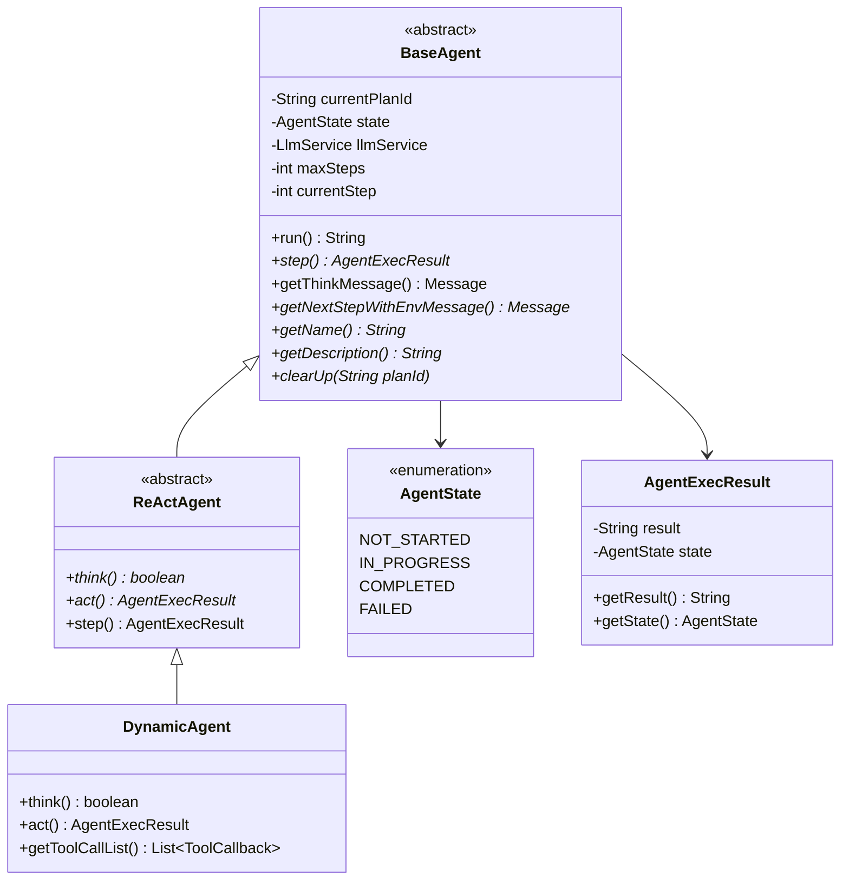
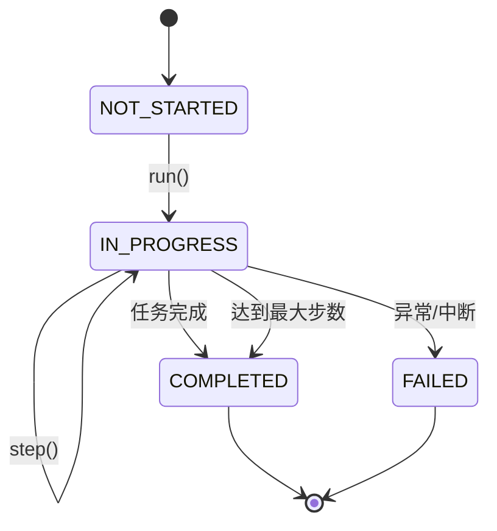
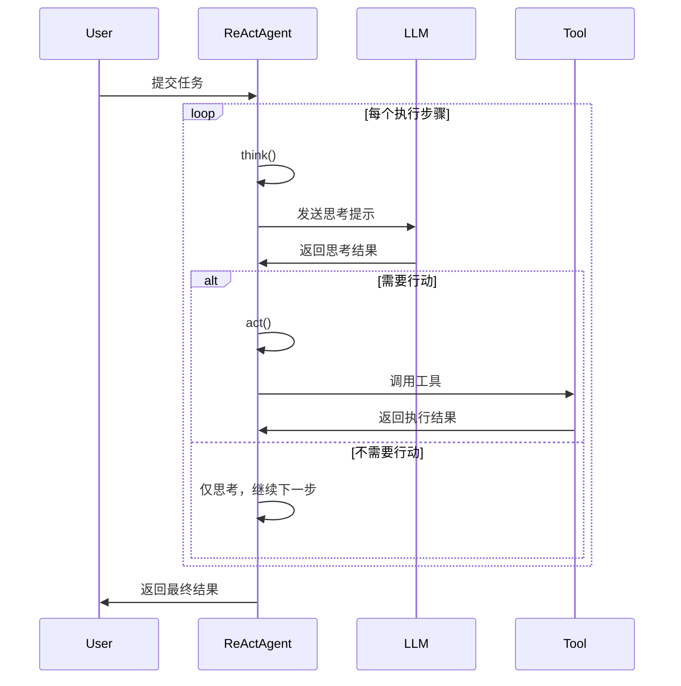

# 02 - 智能体系统详解

## 🤖 智能体概述

JManus 的智能体系统是一个基于 Spring AI Alibaba 的多智能体协作框架，支持不同类型的智能体实现，具有完整的状态管理、工具调用和生命周期管理功能。

## 🏗️ 智能体架构

### 类层次结构



## 📋 智能体状态管理

### AgentState 枚举

智能体具有四种状态，由 `AgentState` 枚举定义：

```java
public enum AgentState {
    NOT_STARTED,  // 未开始
    IN_PROGRESS,  // 执行中
    COMPLETED,    // 已完成
    FAILED        // 执行失败
}
```

### 状态转换流程



## 🔍 BaseAgent 核心实现

### 主要字段

```java
public abstract class BaseAgent {
    // 执行计划ID
    private String currentPlanId = null;
    private String rootPlanId = null;

    // 状态管理
    private AgentState state = AgentState.NOT_STARTED;

    // 核心服务
    protected LlmService llmService;
    protected final ManusProperties manusProperties;
    protected final PromptService promptService;

    // 执行控制
    private int maxSteps;
    private int currentStep = 0;

    // 数据上下文
    private final Map<String, Object> initSettingData;
    private Map<String, Object> envData = new HashMap<>();
}
```

### 核心方法分析

#### 1. run() - 主执行循环

**位置**: `BaseAgent.java:210`

```java
public String run() {
    currentStep = 0;
    if (state != AgentState.IN_PROGRESS) {
        throw new IllegalStateException("Cannot run agent from state: " + state);
    }

    while (currentStep < maxSteps && !state.equals(AgentState.COMPLETED)
           && !state.equals(AgentState.FAILED)) {
        currentStep++;
        log.info("Executing round {}/{}", currentStep, maxSteps);

        AgentExecResult stepResult = step();

        // 卡住检测
        if (isStuck()) {
            handleStuckState();
        } else {
            state = stepResult.getState();
        }
    }

    // 处理达到最大步数的情况
    if (currentStep >= maxSteps) {
        String finalSummary = generateFinalSummary();
        terminateWithSummary(finalSummary);
    }
}
```

**关键特性**:
- **步数限制**: 防止无限执行
- **卡住检测**: 自动检测智能体是否陷入循环
- **状态管理**: 完整的状态转换控制
- **资源清理**: 执行完成后自动清理内存

#### 2. step() - 单步执行

**位置**: `BaseAgent.java:283` (抽象方法)

子类必须实现的核心逻辑，定义每一步的具体执行内容。

#### 3. getThinkMessage() - 构建思考链

**位置**: `BaseAgent.java:146`

```java
protected Message getThinkMessage() {
    // 获取系统信息
    String osName = System.getProperty("os.name");
    String currentDateTime = java.time.LocalDate.now().toString();

    // 构建变量映射
    Map<String, Object> variables = new HashMap<>(getInitSettingData());
    variables.put("osName", osName);
    variables.put("currentDateTime", currentDateTime);

    // 创建系统消息
    return promptService.createSystemMessage(
        PromptEnum.AGENT_STEP_EXECUTION.getPromptName(),
        variables
    );
}
```

#### 4. 卡住检测机制

**位置**: `BaseAgent.java:305`

```java
protected boolean isStuck() {
    List<Message> memoryEntries = llmService.getAgentMemory(manusProperties.getMaxMemory())
                                           .get(getCurrentPlanId());
    int zeroToolCallCount = 0;

    for (Message msg : memoryEntries) {
        if (msg instanceof AssistantMessage) {
            AssistantMessage assistantMsg = (AssistantMessage) msg;
            if (assistantMsg.getToolCalls() == null ||
                assistantMsg.getToolCalls().isEmpty()) {
                zeroToolCallCount++;
            }
        }
    }

    // 连续3次无工具调用视为卡住
    return zeroToolCallCount >= 3;
}
```

## 🧠 ReActAgent 推理-行动模式

### 设计理念

ReAct (Reasoning + Acting) 是一种让 AI 模型在推理和行动之间交替执行的策略，让智能体能够：

1. **思考 (Reasoning)**: 分析当前情况，决定下一步行动
2. **行动 (Acting)**: 执行具体的工具调用或操作
3. **观察 (Observing)**: 查看行动结果，更新认知
4. **循环**: 重复上述过程直到任务完成

### 实现分析

**位置**: `ReActAgent.java:31`

```java
public abstract class ReActAgent extends BaseAgent {

    /**
     * 执行思考过程并确定是否需要采取行动
     */
    protected abstract boolean think();

    /**
     * 执行具体的行动
     */
    protected abstract AgentExecResult act();

    /**
     * 执行完整的思考-行动步骤
     */
    @Override
    public AgentExecResult step() {
        try {
            boolean shouldAct = think();
            if (!shouldAct) {
                return new AgentExecResult(
                    "Thinking complete - no action needed",
                    AgentState.IN_PROGRESS
                );
            }
            return act();
        } catch (TaskInterruptedException e) {
            return new AgentExecResult(
                "Agent execution interrupted: " + e.getMessage(),
                AgentState.FAILED
            );
        }
    }
}
```

### ReAct 循环流程



## 🛠️ DynamicAgent 动态智能体

### 设计特点

DynamicAgent 是 ReActAgent 的具体实现，具有以下特点：

1. **动态工具配置**: 运行时可以选择和配置不同的工具
2. **流式响应处理**: 支持实时的流式 AI 响应
3. **重试机制**: 内置智能重试策略
4. **用户交互支持**: 集成表单输入工具
5. **中断处理**: 完善的任务中断机制

### 核心实现

**位置**: `DynamicAgent.java:69`

#### 1. 构造函数参数

DynamicAgent 接受丰富的配置参数，包括 LLM 服务、工具管理器、流式响应处理器等。

#### 2. think() - 智能思考过程

**位置**: `DynamicAgent.java:151`

关键特性：
- **中断检查**: 在思考开始前检查是否被中断
- **环境数据收集**: 收集所有可用工具的状态信息
- **重试策略**: 最多重试3次，使用指数退避算法

#### 3. 重试机制

**位置**: `DynamicAgent.java:176`

```java
private boolean executeWithRetry(int maxRetries) throws Exception {
    // 指数退避: delay = min(1000 * 2^(attempt-1), 30000ms)
    // 可重试异常: 网络错误、超时、DNS解析失败等
}
```

#### 4. act() - 执行工具调用

**位置**: `DynamicAgent.java:330`

- 检查中断状态
- 执行工具调用
- 处理特殊工具（FormInputTool、TerminableTool）
- 记录执行结果

## 📝 学习要点

1. **状态管理**: 理解智能体的生命周期和状态转换
2. **ReAct 模式**: 掌握思考-行动循环的设计理念
3. **工具系统**: 学会如何使用和扩展工具
4. **错误处理**: 理解重试机制和异常处理策略
5. **流式处理**: 掌握实时响应的实现方式

---

*创建日期：2025-11-14*
*最后更新：2025-11-14*